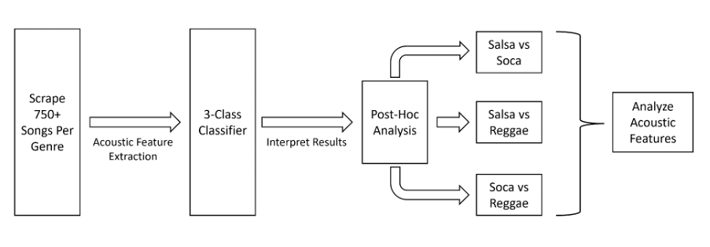

# Music Genre Classification: Salsa, Soca, and Reggae

A machine learning pipeline for automatically classifying Caribbean and Latin music genres using acoustic features extracted from audio recordings.

## Overview



This project implements a supervised classification system to distinguish between three music genres: salsa, soca, and reggae. The pipeline scrapes audio data from YouTube, extracts acoustic features using the OpenSMILE toolkit, and trains multiple machine learning classifiers to identify genre-specific acoustic patterns.

## Methodology

### 1. Data Collection

Songs were collected from YouTube using automated scraping with the following criteria:

- **Sources**: Artist-based queries (63 salsa artists, 100 soca artists, 100 reggae artists)
- **Duration filtering**: Videos between 60-300 seconds (1-5 minutes)
- **File format**: MP3 audio at 192 kbps
- **Target volume**: ~750+ songs per genre

The artist query lists are provided in `data/queries/` and were curated to represent diverse artists within each genre.

### 2. Acoustic Feature Extraction

Features were extracted using OpenSMILE (Open-Source Media Interpretation by Large Feature-Space Extraction) with the eGeMAPSv02 (extended Geneva Minimalistic Acoustic Parameter Set) feature set.

**Sampling Strategy**:
- 4 samples per song (10 seconds each)
- Sample positions distributed around the 1/3 point of each song
- This captures both intro characteristics and main musical content while avoiding intros and outros

**Feature Set**:
- 87 acoustic features per sample
- Features include: pitch, loudness, spectral characteristics, voice quality, temporal dynamics
- Functionals (statistical summaries) computed over each 10-second window

### 3. Classification Approach

**Cross-Validation Strategy**:
- Group-based shuffle split cross-validation (100 splits, 80/20 train/test)
- Groups ensure all samples from the same song stay together in either train or test set
- Prevents data leakage and provides realistic performance estimates

**Classifiers Tested**:
- Extra Trees Classifier
- Logistic Regression
- Support Vector Machine (SVM)
- Multi-Layer Perceptron (MLP)

All classifiers use standardized features and class weighting to handle potential class imbalances.

### 4. Post-Hoc Analysis

Following 3-class classification, pairwise binary classifiers were trained to analyze:
- Genre-pair separability (Salsa vs Soca, Salsa vs Reggae, Soca vs Reggae)
- Feature importance analysis using weighted scores across cross-validation folds
- Identification of most discriminative acoustic features for each genre comparison

## Results

### 3-Class Classification Performance

| Classifier | Median Accuracy |
|------------|----------------|
| Extra Trees | 78.97% |
| Logistic Regression | 79.61% |
| **SVM** | **81.42%** |
| MLP | 78.07% |

The SVM classifier achieved the best performance with a median accuracy of 81.42% across 100 cross-validation splits.

### Pairwise Classification Performance

| Comparison | Median Accuracy | Median ROC-AUC |
|------------|----------------|----------------|
| Salsa vs Soca | 89.48% | 88.29% |
| Salsa vs Reggae | 84.19% | 84.19% |
| Soca vs Reggae | 83.09% | 82.04% |

Pairwise classification shows that salsa and soca are most distinguishable, while soca and reggae show the most acoustic overlap.

## Dataset

### Genre Descriptions

**Salsa**: A Latin dance music genre that originated in New York City in the 1960s-70s, blending Cuban son, Puerto Rican rhythms, and jazz elements. Characterized by complex polyrhythmic percussion, brass sections, and syncopated piano patterns.

**Soca**: A genre of Caribbean music that originated in Trinidad and Tobago in the 1970s, combining calypso with Indian rhythms and modern electronic elements. Known for its high energy, fast tempo, and emphasis on rhythm and percussion.

**Reggae**: A music genre that originated in Jamaica in the late 1960s, characterized by a distinctive rhythmic pattern (the "one drop" rhythm), emphasis on the offbeat, and socially conscious lyrics. Features bass-heavy production and relaxed tempos.

### Data Statistics

- **Total audio files**: 2,803 songs
  - Salsa: 748 songs (2,992 samples)
  - Soca: 1,239 songs (4,956 samples)
  - Reggae: 816 songs (3,264 samples)
- **Features per sample**: 87 acoustic features
- **Total samples**: 11,212 (4 samples per song)

## Installation

### Requirements

- Python 3.8+
- FFmpeg (for audio processing)

### Setup

1. Clone this repository:
```bash
git clone https://github.com/yourusername/music-genre-classifier.git
cd music-genre-classifier
```

2. Install required packages:
```bash
pip install -r requirements.txt
```

3. Install FFmpeg (if not already installed):
```bash
# macOS
brew install ffmpeg

# Ubuntu/Debian
sudo apt-get install ffmpeg

# Windows
# Download from https://ffmpeg.org/download.html
```

## Usage

### 1. Download Audio Data

Download songs from YouTube based on artist queries:

```bash
python src/download_data.py data/queries/salsa_queries.csv audio_data/salsa/
python src/download_data.py data/queries/soca_queries.csv audio_data/soca/
python src/download_data.py data/queries/reggae_queries.csv audio_data/reggae/
```

### 2. Extract Acoustic Features

Extract eGeMAPSv02 features from the downloaded audio files:

```bash
python src/extract_features.py \
    audio_data/salsa/ \
    audio_data/soca/ \
    audio_data/reggae/ \
    data/features/
```

This will create three CSV files in `data/features/`:
- `salsa_concatenated.csv`
- `soca_concatenated.csv`
- `reggae_concatenated.csv`

### 3. Train 3-Class Classifier

Train and evaluate classifiers on all three genres:

```bash
python src/train_classifier.py data/features/ --output-dir results/

# Train specific classifier only
python src/train_classifier.py data/features/ --classifier svm --output-dir results/
```

This generates:
- Classification performance metrics
- Confusion matrices for each classifier
- Results summary CSV

### 4. Pairwise Analysis and Feature Importance

Perform pairwise genre classification and analyze discriminative features:

```bash
python src/pairwise_analysis.py data/features/ --output-dir results/
```

This generates:
- Pairwise classification results
- Feature importance plots for each genre pair
- Top discriminative features for each comparison

## Project Structure

```
music-genre-classifier/
├── README.md                 # This file
├── overview_fig.png          # Workflow diagram
├── requirements.txt          # Python dependencies
├── .gitignore               # Git ignore rules
├── src/
│   ├── __init__.py
│   ├── download_data.py     # YouTube audio scraping
│   ├── extract_features.py  # Acoustic feature extraction
│   ├── train_classifier.py  # 3-class classifier training
│   ├── pairwise_analysis.py # Binary classification & feature importance
│   └── utils.py             # Shared utility functions
├── data/
│   ├── queries/             # Artist query lists for each genre
│   │   ├── salsa_queries.csv
│   │   ├── soca_queries.csv
│   │   └── reggae_queries.csv
│   └── README.md            # Data directory documentation
└── results/                 # Generated results (gitignored)
```

## Key Features

- **Robust sampling strategy**: Multiple samples per song reduce overfitting to specific recordings
- **Group-based cross-validation**: Ensures generalization to new songs, not just new segments
- **Feature importance analysis**: Identifies which acoustic characteristics distinguish genres
- **Multiple classifier comparison**: Evaluates different ML approaches for the task

## Dependencies

Core libraries:
- `opensmile`: Acoustic feature extraction
- `scikit-learn`: Machine learning classifiers and evaluation
- `yt-dlp` & `pytube`: YouTube audio downloading
- `audiofile`: Audio file I/O
- `pandas` & `numpy`: Data manipulation
- `matplotlib` & `seaborn`: Visualization

See `requirements.txt` for complete list with version specifications.

